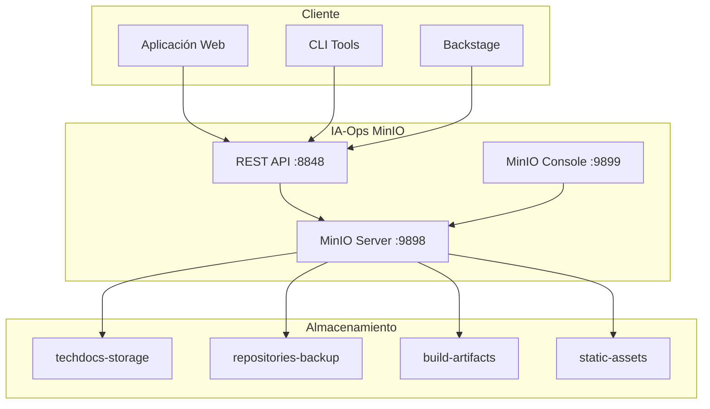

# 🗄️ IA-Ops MinIO Storage Solution

Bienvenido a la documentación completa del sistema de almacenamiento MinIO para el ecosistema IA-Ops TechDocs.

## ¿Qué es este proyecto?

IA-Ops MinIO es una solución de almacenamiento S3 compatible que proporciona:

- **Almacenamiento distribuido** para documentación técnica
- **API REST** para gestión de archivos y buckets
- **Integración completa** con el ecosistema IA-Ops
- **Despliegue automatizado** con Docker

## 🚀 Inicio Rápido

=== "Portal Integrado (Recomendado)"

    ```bash
    # Clonar repositorio
    git clone git@github.com:giovanemere/ia-ops-minio.git
    cd ia-ops-minio
    
    # Despliegue limpio completo
    ./scripts/deploy-clean.sh
    
    # Acceder al dashboard
    open http://localhost:6540
    ```

=== "Producción con Docker Hub"

    ```bash
    # Pipeline completo automatizado
    ./scripts/deploy-integrated-full.sh
    
    # O paso a paso
    ./scripts/build-integrated.sh
    ./scripts/publish-integrated.sh
    ./scripts/switch-integrated.sh prod
    ```

## 📊 URLs de Acceso

| Servicio | URL | Descripción |
|----------|-----|-------------|
| **Dashboard Principal** | [http://localhost:6540](http://localhost:6540) | Portal unificado |
| **MinIO Console** | [http://localhost:9899](http://localhost:9899) | Interfaz web de administración |
| **MinIO API** | [http://localhost:9898](http://localhost:9898) | API S3 compatible |
| **REST API** | [http://localhost:8848](http://localhost:8848) | API personalizada |
| **Documentación** | [http://localhost:6541](http://localhost:6541) | Esta documentación |

!!! info "Credenciales por defecto"
    - **Usuario**: `minioadmin`
    - **Contraseña**: `minioadmin123`

## 🏗️ Arquitectura del Sistema



## 🎯 Características Principales

### 🔧 Gestión Automatizada

- **Scripts de despliegue** completamente automatizados
- **Build y test** integrados
- **Publicación a Docker Hub** automática
- **Cambio entre entornos** dev/prod

### 🌐 API REST Completa

- **Gestión de buckets** (crear, listar, eliminar)
- **Operaciones con objetos** (subir, descargar, eliminar)
- **Metadatos** y estadísticas
- **Health checks** integrados

### 🐳 Docker Ready

- **Contenedores optimizados** para producción
- **Multi-arquitectura** (AMD64/ARM64)
- **Volúmenes persistentes** configurados
- **Redes aisladas** para seguridad

## 📦 Buckets Predefinidos

| Bucket | Propósito | Política |
|--------|-----------|----------|
| `techdocs-storage` | Documentación principal | Pública |
| `repositories-backup` | Respaldos de repositorios | Privada |
| `build-artifacts` | Artefactos de construcción | Privada |
| `static-assets` | Recursos estáticos | Pública |

## 🔗 Integración con IA-Ops

Este sistema se integra perfectamente con:

- **[ia-ops-docs](https://github.com/giovanemere/ia-ops-docs)** - Documentación principal
- **[ia-ops-backstage](https://github.com/giovanemere/ia-ops-backstage)** - Portal Backstage
- **[ia-ops-framework](https://github.com/giovanemere/ia-ops-framework)** - Framework base

## 🚀 Próximos Pasos

1. **[Instalación](getting-started/installation.md)** - Configura tu entorno
2. **[¿Qué es MinIO?](minio/what-is-minio.md)** - Aprende los conceptos básicos
3. **[API REST](api/introduction.md)** - Explora las capacidades de la API
4. **[Scripts](scripts/commands.md)** - Domina las herramientas de gestión

---

!!! tip "¿Necesitas ayuda?"
    Consulta la sección de [Troubleshooting](reference/troubleshooting.md) o revisa los [ejemplos de la API](api/examples.md).
