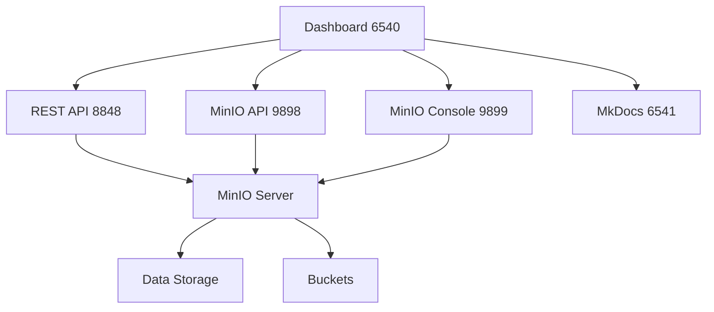

# 🏗️ Arquitectura

## Arquitectura General

## Componentes Principales

### 🏠 Dashboard (Puerto 6540)
- Portal web unificado
- Interfaz de administración
- Enlaces a todos los servicios
- Documentación integrada

### 🖥️ MinIO Console (Puerto 9899)
- Interfaz web oficial de MinIO
- Administración de buckets y objetos
- Gestión de usuarios y políticas
- Monitoreo del sistema

### 🚀 REST API (Puerto 8848)
- API personalizada para gestión
- Endpoints simplificados
- Integración con aplicaciones
- Operaciones CRUD en buckets

### 📡 MinIO API (Puerto 9898)
- API S3 compatible
- Protocolo estándar de Amazon S3
- Compatible con SDKs existentes
- Operaciones de almacenamiento

### 📚 MkDocs (Puerto 6541)
- Documentación completa
- Material Design theme
- Navegación estructurada
- Contenido markdown

## Flujo de Datos

### Subida de Archivos
1. Cliente → MinIO API (9898)
2. MinIO API → MinIO Server
3. MinIO Server → Almacenamiento

### Gestión via REST API
1. Cliente → REST API (8848)
2. REST API → MinIO Server
3. Respuesta → Cliente

### Administración Web
1. Usuario → MinIO Console (9899)
2. Console → MinIO Server
3. Operaciones → Almacenamiento

## Seguridad

### Autenticación
- Credenciales por defecto: `minioadmin/minioadmin123`
- Soporte para múltiples usuarios
- Políticas de acceso granulares

### Comunicación
- HTTP para desarrollo
- HTTPS recomendado para producción
- Tokens de acceso temporales

## Escalabilidad

### Horizontal
- Múltiples nodos MinIO
- Distribución de datos
- Alta disponibilidad

### Vertical
- Aumento de recursos
- Optimización de almacenamiento
- Cache y performance
