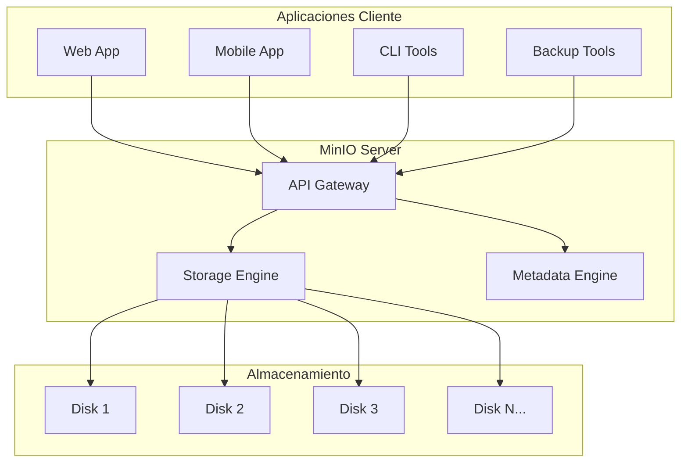

# ¿Qué es MinIO?

MinIO es un servidor de almacenamiento de objetos de alto rendimiento, compatible con la API de Amazon S3. Es la solución de almacenamiento en la nube más popular para aplicaciones nativas de Kubernetes.

## 🎯 Características Principales

### 🚀 Alto Rendimiento
- **Throughput masivo**: Hasta 325 GiB/s en un solo nodo
- **Latencia ultra-baja**: Operaciones en microsegundos
- **Escalabilidad horizontal**: Desde un solo nodo hasta exabytes

### 🔒 Seguridad Empresarial
- **Cifrado**: AES-256-GCM, ChaCha20-Poly1305 y AES-CBC
- **Autenticación**: IAM, LDAP/AD, OpenID Connect
- **Auditoría**: Logs detallados de todas las operaciones

### 🌐 Compatibilidad S3
- **API completa**: 100% compatible con Amazon S3
- **SDKs**: Disponible para todos los lenguajes principales
- **Herramientas**: Compatible con herramientas existentes de S3

## 🏗️ Arquitectura



## 📦 Conceptos Fundamentales

### Buckets (Contenedores)
Los **buckets** son contenedores lógicos que almacenan objetos. Características:

- **Nombres únicos** globalmente
- **Políticas de acceso** configurables
- **Versionado** opcional
- **Cifrado** a nivel de bucket

```bash
# Crear bucket
mc mb minio/mi-bucket

# Listar buckets
mc ls minio/
```

### Objects (Objetos)
Los **objetos** son los archivos almacenados. Incluyen:

- **Datos**: El contenido del archivo
- **Metadatos**: Información adicional (headers HTTP)
- **Clave**: Identificador único dentro del bucket

```bash
# Subir objeto
mc cp archivo.pdf minio/mi-bucket/

# Descargar objeto
mc cp minio/mi-bucket/archivo.pdf ./
```

### Políticas de Acceso
Controlan quién puede acceder a qué recursos:

```json
{
  "Version": "2012-10-17",
  "Statement": [
    {
      "Effect": "Allow",
      "Principal": {"AWS": "*"},
      "Action": "s3:GetObject",
      "Resource": "arn:aws:s3:::mi-bucket/*"
    }
  ]
}
```

## 🔧 Casos de Uso

### 1. Almacenamiento de Aplicaciones
```python
from minio import Minio

client = Minio('localhost:9898',
    access_key='minioadmin',
    secret_key='minioadmin123',
    secure=False
)

# Subir archivo
client.fput_object('app-data', 'user-avatar.jpg', '/path/to/avatar.jpg')
```

### 2. Backup y Archivado
```bash
# Sincronizar directorio
mc mirror /local/backup/ minio/backups/

# Backup con retención
mc rm --recursive --force --older-than 30d minio/backups/
```

### 3. Distribución de Contenido
```bash
# Hacer bucket público
mc policy set public minio/static-assets/

# URL pública
https://localhost:9898/static-assets/logo.png
```

## ⚡ Ventajas de MinIO

| Característica | Beneficio |
|----------------|-----------|
| **Open Source** | Sin costos de licencia, código auditable |
| **Cloud Native** | Diseñado para Kubernetes y contenedores |
| **Multi-Cloud** | Funciona en cualquier infraestructura |
| **Simplicidad** | Instalación y configuración sencillas |
| **Performance** | Optimizado para cargas de trabajo modernas |

## 🆚 MinIO vs Alternativas

=== "vs Amazon S3"
    
    | Aspecto | MinIO | Amazon S3 |
    |---------|-------|-----------|
    | **Costo** | Gratuito | Pay-per-use |
    | **Control** | Total | Limitado |
    | **Latencia** | Ultra-baja | Variable |
    | **Vendor Lock-in** | No | Sí |

=== "vs Almacenamiento Tradicional"
    
    | Aspecto | MinIO | NFS/CIFS |
    |---------|-------|----------|
    | **Escalabilidad** | Horizontal | Limitada |
    | **API** | REST/S3 | Protocolos legacy |
    | **Metadatos** | Ricos | Básicos |
    | **Distribución** | Global | Local |

## 🎯 En el Contexto de IA-Ops

En nuestro ecosistema IA-Ops, MinIO proporciona:

1. **Almacenamiento centralizado** para documentación técnica
2. **API unificada** para todas las aplicaciones
3. **Escalabilidad** para crecimiento futuro
4. **Compatibilidad** con herramientas existentes
5. **Seguridad** para datos sensibles

!!! success "¿Por qué elegimos MinIO?"
    MinIO nos permite tener un almacenamiento S3-compatible on-premise, con total control sobre nuestros datos y sin dependencias externas.

## 📚 Recursos Adicionales

- [Documentación Oficial de MinIO](https://docs.min.io/)
- [MinIO Client (mc) Guide](https://docs.min.io/docs/minio-client-complete-guide.html)
- [S3 API Reference](https://docs.aws.amazon.com/s3/)
